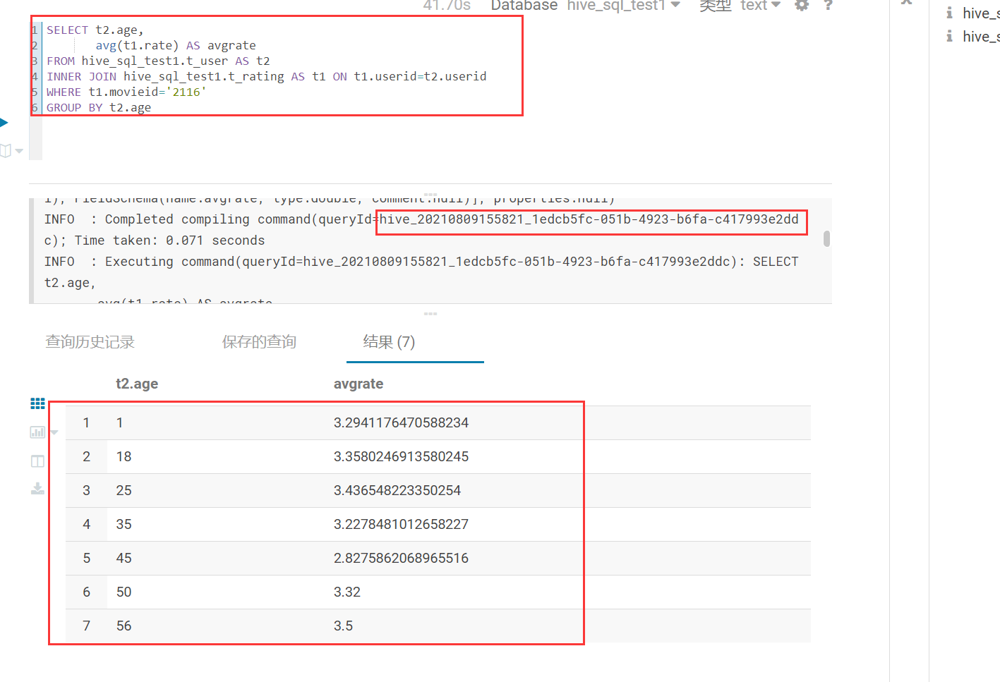
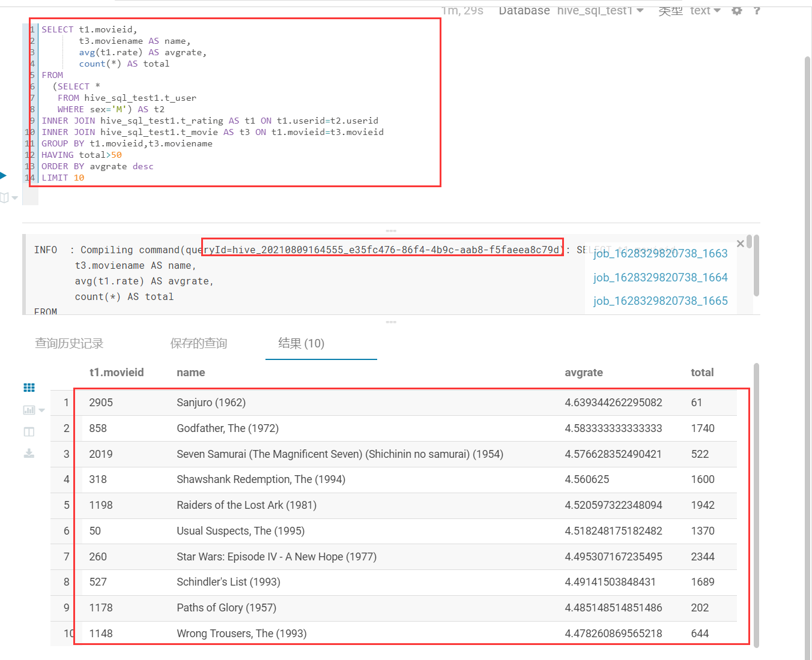
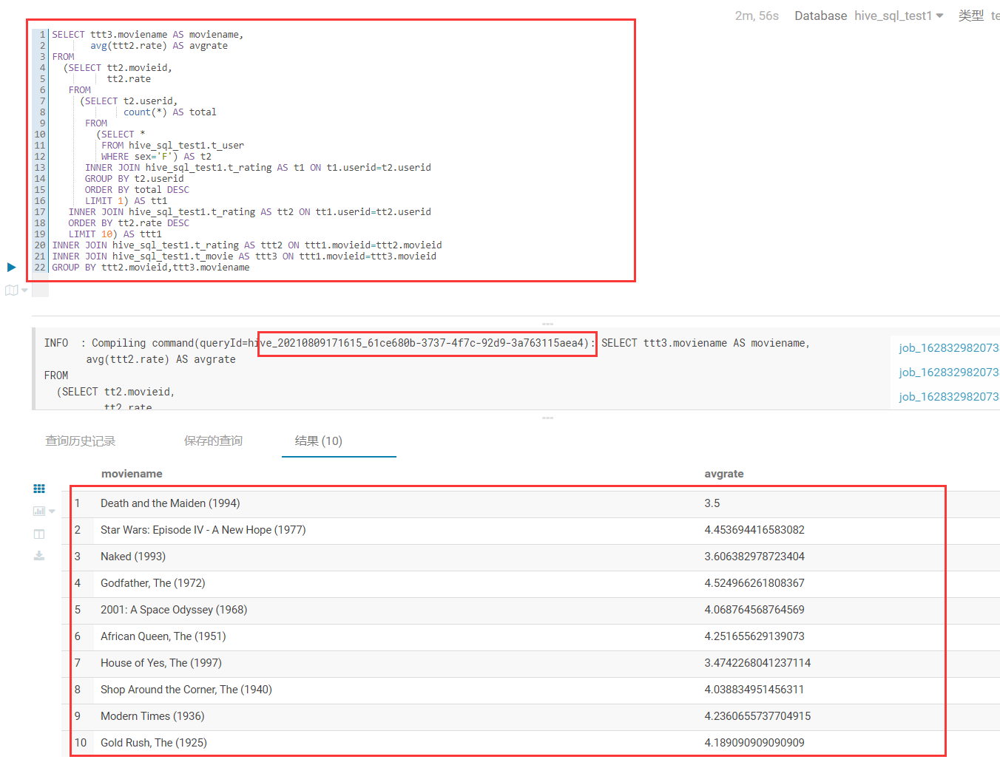

*[MR编程程序]()

*[HadoopRPC运行结果图]()

*[ava API 操作HBase]()

*[Hive作业]()
# MR编程程序
MR程序Yarn运行成功示意图

MR运行结果图

# HadoopRPC运行结果图
输入学号：20210123456789

输入学号：20210735010150

输入学号：20210000000000

# Java API 操作HBase
查询数据结果

HBase API

# Hive作业
题目一

题目二

题目三
